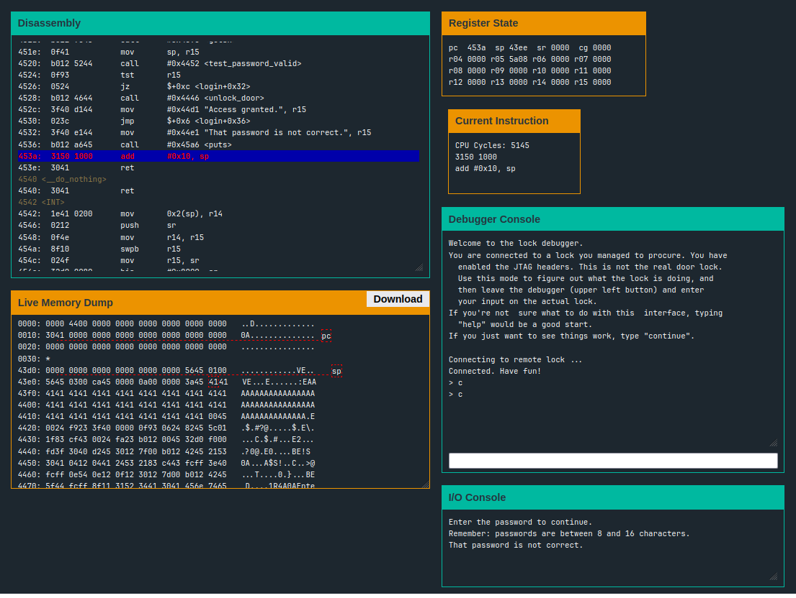
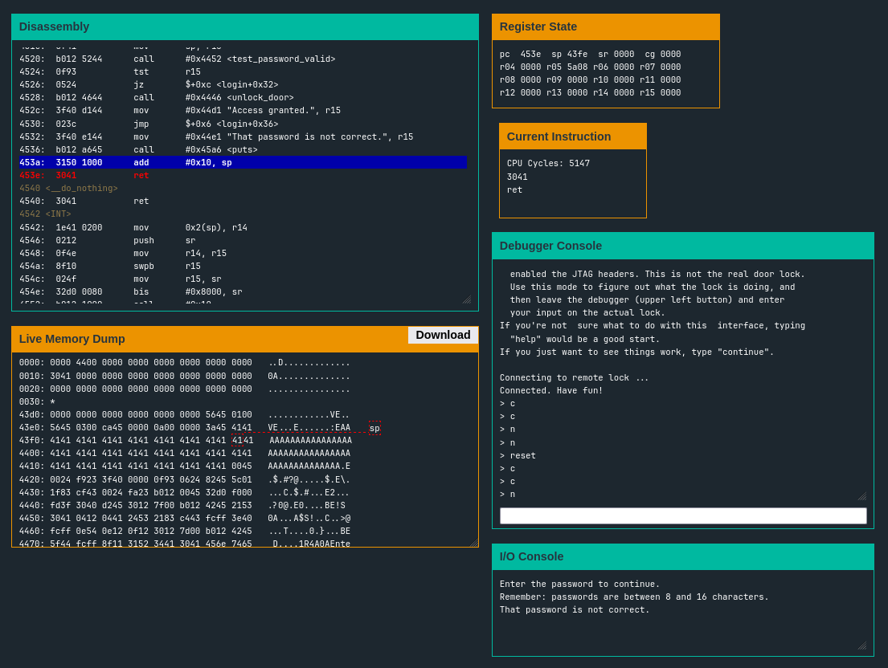
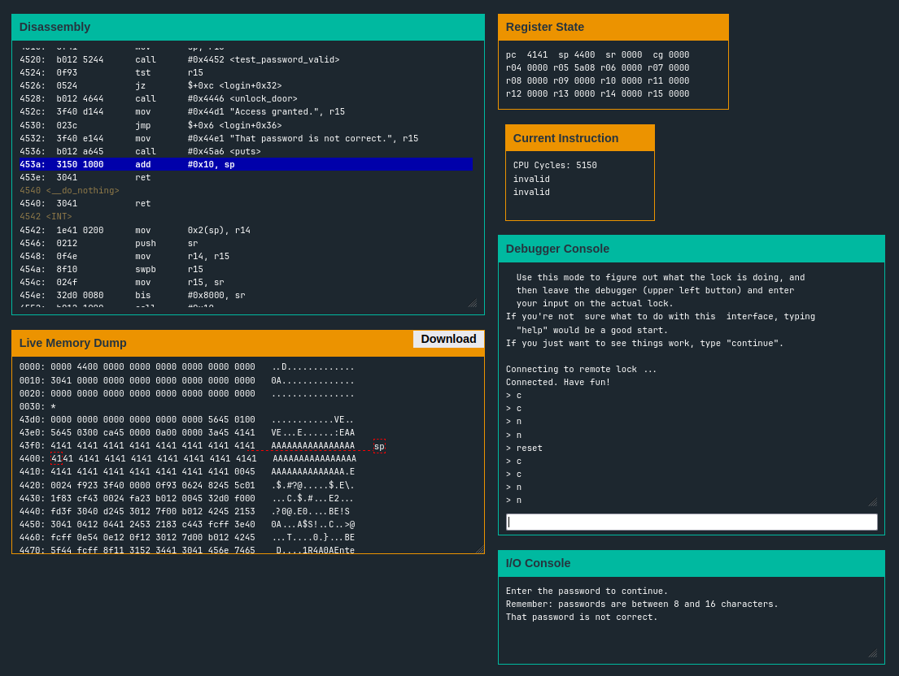

- In this level also, we are presented with a similar assembly in the level of Hanoi, however this time the login function is a bit different, which is presented as follows:
```assembly
4452 <test_password_valid>
4452:  0412           push	r4
4454:  0441           mov	sp, r4
4456:  2453           incd	r4
4458:  2183           decd	sp
445a:  c443 fcff      mov.b	#0x0, -0x4(r4)
445e:  3e40 fcff      mov	#0xfffc, r14
4462:  0e54           add	r4, r14
4464:  0e12           push	r14
4466:  0f12           push	r15
4468:  3012 7d00      push	#0x7d
446c:  b012 4245      call	#0x4542 <INT>
4470:  5f44 fcff      mov.b	-0x4(r4), r15
4474:  8f11           sxt	r15
4476:  3152           add	#0x8, sp
4478:  3441           pop	r4
447a:  3041           ret

4500 <login>
4500:  3150 f0ff      add	#0xfff0, sp
4504:  3f40 7c44      mov	#0x447c "Enter the password to continue.", r15
4508:  b012 a645      call	#0x45a6 <puts>
450c:  3f40 9c44      mov	#0x449c "Remember: passwords are between 8 and 16 characters.", r15
4510:  b012 a645      call	#0x45a6 <puts>
4514:  3e40 3000      mov	#0x30, r14
4518:  0f41           mov	sp, r15
451a:  b012 9645      call	#0x4596 <getsn>
451e:  0f41           mov	sp, r15
4520:  b012 5244      call	#0x4452 <test_password_valid>
4524:  0f93           tst	r15
4526:  0524           jz	$+0xc <login+0x32>
4528:  b012 4644      call	#0x4446 <unlock_door>
452c:  3f40 d144      mov	#0x44d1 "Access granted.", r15
4530:  023c           jmp	$+0x6 <login+0x36>
4532:  3f40 e144      mov	#0x44e1 "That password is not correct.", r15
4536:  b012 a645      call	#0x45a6 <puts>
453a:  3150 1000      add	#0x10, sp
453e:  3041           ret
4540 <__do_nothing>
4540:  3041           ret
```
- Now the code presented here is not reading the password that we presented to it at all, and hence on first look it looks uncrackable
- However, if we have a look at the live memory dump once the control flow reaches the end of `login` function, we can see something interesting
- Also, point to be noted here is, the program does not check on the length of the input that we are providing, which means we can 'potentially' override some of the stuff which was not intended to be
- To test our assumptions, let's input the string `AAAAAAAAAAAAAAAAAAAAAAAAAAAAAAAAAAAAAAAAAAAAAAAAAAAAAAAAAAAAAAAA` (contains 64 `A`s) and place the breakpoint at the end of the `login` function call



- We can see that the 64 `A`s we filled, have overwritten some of the stuff. We also got the error message that the password is not correct but that's fine. For now let's step further and see what happens
- In the next step, the stack pointer is incremented by `0x10`, and reaches inside our filled input area



- Now, we take one more step, and see what happens. The theory behind this is, the stack pointer would decrement, popping one byte off the stack into the program counter and the next instruction to be executed would be under our control. Let's see



- Have a look at the value of `pc`, it is `0x4141`, and the current instruction block above the debugger console says invalid, which is true as it doesn't point to some valid address in the memory, however this opens up an opportunity for us
- We can now control whatever memory location we can point our program counter to, effectively taking over the program (smells like buffer overflow, isn't it?)
- So, one valid location for us would be `0x4446`, as it points to the address of the function `unlock_door`
- Now all we need to do is to just fill the input `buffer` with this value, and let it `overflow` so that we can execute the `unlock_door` method
- For this, we can just fill the input with `4446` repeatedly (in hex format, obviously). However since our CPU is little endian, we need to flip the order of bytes, as `4446` would be stored in the memory as `4644`
- Here's the payload that I used: `46444644464446444644464446444644464446444644464446444644464446444644464446444644464446444644464446444644464446444644464446444644` (String `4644` repeated 32 times)
- Using this payload, we get the success message, and hence this level also gets done and dusted :)