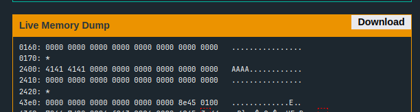
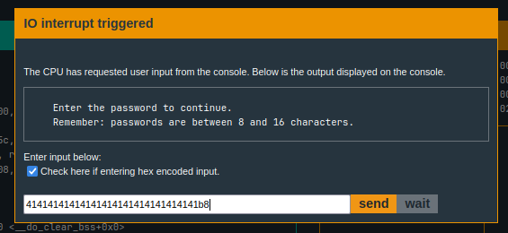
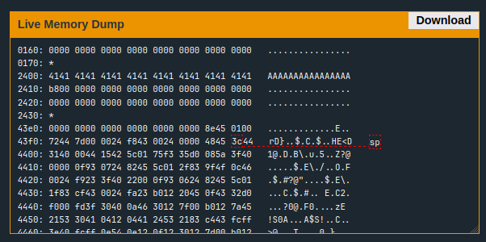

- This level doesn't contain any comparison with any fixed values, instead we are presented with two functions, `login` and `test_password_valid`
- In the `main` function, the `login` function is called that handles everything
- We have the following assembly that's of interest to us:
```
4520 <login>
4520:  c243 1024      mov.b	#0x0, &0x2410
4524:  3f40 7e44      mov	#0x447e "Enter the password to continue.", r15
4528:  b012 de45      call	#0x45de <puts>
452c:  3f40 9e44      mov	#0x449e "Remember: passwords are between 8 and 16 characters.", r15
4530:  b012 de45      call	#0x45de <puts>
4534:  3e40 1c00      mov	#0x1c, r14
4538:  3f40 0024      mov	#0x2400, r15
453c:  b012 ce45      call	#0x45ce <getsn>
4540:  3f40 0024      mov	#0x2400, r15
4544:  b012 5444      call	#0x4454 <test_password_valid>
4548:  0f93           tst	r15
454a:  0324           jz	$+0x8 <login+0x32>
454c:  f240 7700 1024 mov.b	#0x77, &0x2410
4552:  3f40 d344      mov	#0x44d3 "Testing if password is valid.", r15
4556:  b012 de45      call	#0x45de <puts>
455a:  f290 b800 1024 cmp.b	#0xb8, &0x2410
4560:  0720           jnz	$+0x10 <login+0x50>
4562:  3f40 f144      mov	#0x44f1 "Access granted.", r15
4566:  b012 de45      call	#0x45de <puts>
456a:  b012 4844      call	#0x4448 <unlock_door>
456e:  3041           ret
4570:  3f40 0145      mov	#0x4501 "That password is not correct.", r15
4574:  b012 de45      call	#0x45de <puts>
4578:  3041           ret

4454 <test_password_valid>
4454:  0412           push	r4
4456:  0441           mov	sp, r4
4458:  2453           incd	r4
445a:  2183           decd	sp
445c:  c443 fcff      mov.b	#0x0, -0x4(r4)
4460:  3e40 fcff      mov	#0xfffc, r14
4464:  0e54           add	r4, r14
4466:  0e12           push	r14
4468:  0f12           push	r15
446a:  3012 7d00      push	#0x7d
446e:  b012 7a45      call	#0x457a <INT>
4472:  5f44 fcff      mov.b	-0x4(r4), r15
4476:  8f11           sxt	r15
4478:  3152           add	#0x8, sp
447a:  3441           pop	r4
447c:  3041           ret
```
- After going through the `test_password_valid` function, it can be seen that it's not doing anything significant except than setting `r15` to `0`
- In login, I found that if the value of `r15` is `0`, the jump on address `454a` is taken, and the PC jumps to instruction on address `4552`, which then compares the value `b8` to some random memory location with address `2410`
- I also observed that whatever input I give to the program is stored just before this interesting address, which is shown in the following live memory dump (I had provided input AAAA):


- So, if I fill the input till the required address, and enter the last value as `b8`, the comparison should succeed. Hence, let's try that


- Since I wanted to enter `b8` as hex, I have used hex encoded input as an option. The input consists of 16 `A`s followed by the hex value `b8`
- This makes our memory look like this:


- Now our comparison on address `455a` works, and we get the access
- So the solution for this level looks like this: `<16 random characters> + <magic value>`
- The magic value is `b8` in our case. It might be different for someone else playing the same level