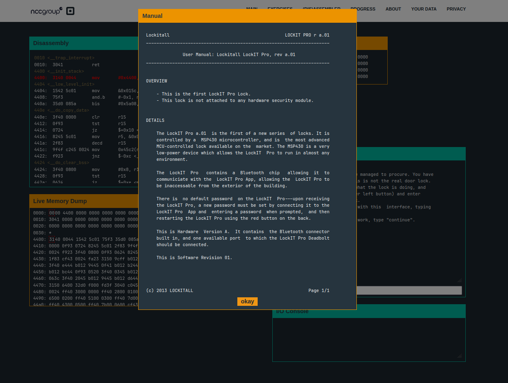

- This is the first challenge after the tutorial level. Upon the page load, we are presented with the following popup:

- We are presented with the disassembly of the code, and upon going through it, we have a function called `check_password`, whose code looks like this:
```assembly
44bc:  0e43           clr	r14
44be:  0d4f           mov	r15, r13
44c0:  0d5e           add	r14, r13
44c2:  ee9d 0024      cmp.b	@r13, 0x2400(r14)
44c6:  0520           jnz	$+0xc <check_password+0x16>
44c8:  1e53           inc	r14
44ca:  3e92           cmp	#0x8, r14
44cc:  f823           jnz	$-0xe <check_password+0x2>
44ce:  1f43           mov	#0x1, r15
44d0:  3041           ret
44d2:  0f43           clr	r15
44d4:  3041           ret
```
- Upon going through the code for a bit, we can see that there is a comparison on line `44c2`, and it is comparing the value pointed to by the address in `r13` to offset `2400` from `r14`. This might be something interesting
- So first we continue the program by setting a breakpoint on the `check_password` function, and then hitting `c` to run the program until the first breakpoint
- When prompted for a password, we type `test` and submit it
- Then we keep on executing until we hit the line `44c2`. At this stage, we look into the live memory dump, and see the memory address `2400` (The value of `r14` at this stage is `0`, hence the final memory address is `2400`)
- We can see a string of legible text, `0(eQ}C{` . Let's keep that with us and continue the execution. 
- The password we entered, `test`, is obviously wrong, and hence we get the message of invalid password.
- However, upon resetting the CPU and entering the string we found from the memory, `0(eQ}C{`, we are able to solve the challenge
- Hence, obtained password for this level: `0(eQ}C{`