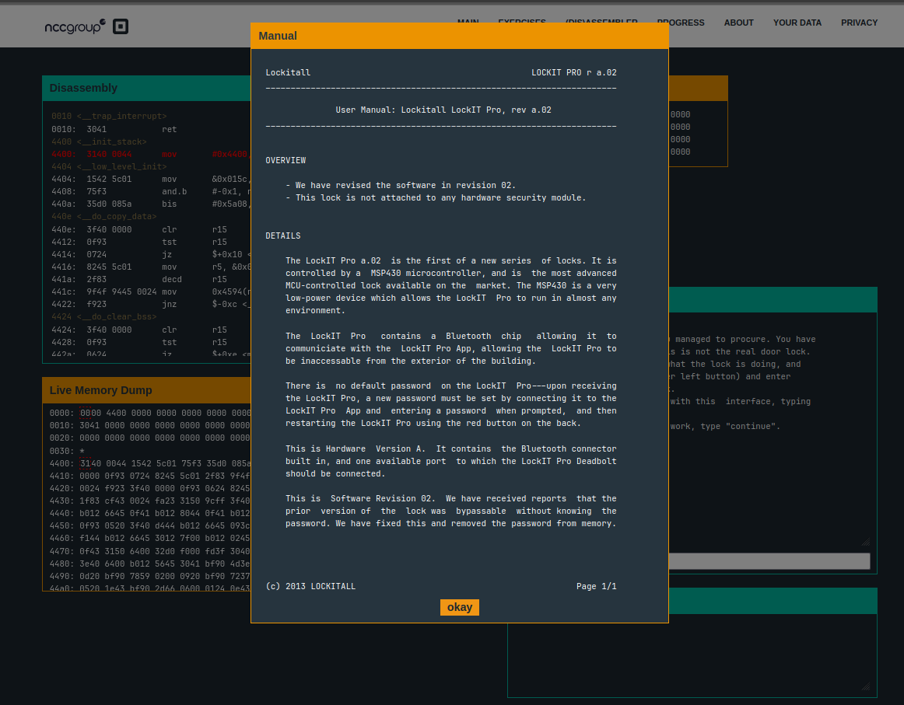
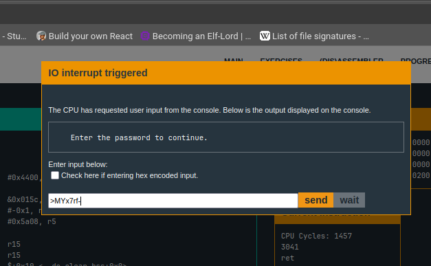

- In this level we are presented with the following intro:


- The last line of the intro states that the password has been removed from the memory, so that might be a hint for what we are up to
- In this level too we have a `check_password` function, whose code looks like this:
```assembly
448a <check_password>
448a:  bf90 4d3e 0000 cmp	#0x3e4d, 0x0(r15)
4490:  0d20           jnz	$+0x1c <check_password+0x22>
4492:  bf90 7859 0200 cmp	#0x5978, 0x2(r15)
4498:  0920           jnz	$+0x14 <check_password+0x22>
449a:  bf90 7237 0400 cmp	#0x3772, 0x4(r15)
44a0:  0520           jnz	$+0xc <check_password+0x22>
44a2:  1e43           mov	#0x1, r14
44a4:  bf90 2d66 0600 cmp	#0x662d, 0x6(r15)
44aa:  0124           jz	$+0x4 <check_password+0x24>
44ac:  0e43           clr	r14
44ae:  0f4e           mov	r14, r15
44b0:  3041           ret
```
- We see that there are a bunch of compare statements, and each one of them are comparing 2 byes of hex to the address pointed to by `r15`, with some offset
- Let's put all those hex values (on lines `448a`, `4492`, `449a`, and `44a4`) together in cyberchef and see what we get
- Upon joining the hex values, we get this string: `3e 4d 59 78 37 72 66 2d`, which gives us this in cyberchef : `>MYx7rf-`
- Let's try entering this as the input in the level and see if it works


- Once we step through the `check_password` function, after the comparison the jump occurs, and we see that the `ZERO` flag doesn't get set. So what's the deal here? It turns out to be that endianness is the issue here
- The CPU we are working with is little endian, which means it stores the least significant byte first, due to which our comparison check fails
- So, in order to bypass this, we modify the input to the program by swapping out the bytes, and putting them in little endian order
- We modify our hex as `4d 3e 78 59 72 37 2d 66`, which gives us the following text: `M>xYr7-f`
- After putting this input, our comparisons work as expected, and we crack the lock
- Key takeaway here is, endianness, and since we are comparing 2 bytes, it comes in picture. The order of the bytes matter in the way they are interpreted.
- Obtained password: `M>xYr7-f`